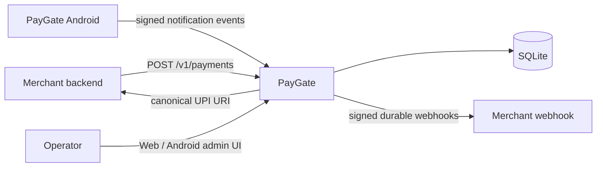

<p align="center">
  
</p>

<p align="center">
  <strong>Self-hosted UPI payment verification with a provider-blind API, signed Android relay, direct SQLite persistence, and durable webhooks.</strong>
</p>

# PayGate

PayGate creates a payment instruction with a unique exact payable amount, watches supported incoming-payment notifications through one trusted Android phone, and marks the matching payment only when the server can do so unambiguously.

The payer sends money directly to the configured UPI account. PayGate does not custody, route, or settle funds; notification matching is an evidence mechanism rather than a bank/acquirer settlement guarantee.

## Current architecture



PayGate v4 is deliberately small:

- one Go server process;
- one direct SQLite database using WAL, `synchronous=FULL`, foreign keys and bounded busy timeout;
- one Android app that combines operator UI with the background notification relay;
- one active collection profile for new payments;
- a durable webhook outbox;
- no PocketBase runtime, Redis, PostgreSQL, server-side Google Messages session, or external queue.
## Payment model

A merchant asks for a whole-INR amount. PayGate resolves the active collection profile and reserves a randomized non-`.00` payable value.

For a ₹100 request, PayGate first selects among free `₹100.01 … ₹100.99` values. Only when that entire bucket is unavailable can it overflow into `₹101.01 … ₹101.99`. The maximum v4.0 adjustment is therefore ₹1.99.

The default lifecycle is:

```text
5 minutes active → 5 minutes grace → 5 minutes hard quarantine
```

Released values also receive soft recent-use avoidance when alternatives exist.

Matching is server-owned and uses the inferred collection profile, exact payable amount, reservation/lifecycle state, trustworthy occurrence time, and unique signed relay-event identity. The Android client never declares a payment successful.

## Supported collection signals

v4.0 currently supports:

- **Paytm for Business** payment notifications;
- **Kotak** credit notifications delivered by Google Messages on the PayGate phone.

The merchant does not select Paytm or Kotak. PayGate snapshots the active profile and destination when the payment is created, so later profile changes cannot alter an existing payment.

## Merchant API

Create a payment:

```http
POST /v1/payments
Authorization: Bearer <merchant-api-key>
Idempotency-Key: <unique-key>
Content-Type: application/json
```

```json
{
  "amount": 100,
  "name": "Asha Nair",
  "external_id": "event_2026",
  "metadata": { "registration_id": "reg_284" }
}
```
The response is provider-blind and contains PayGate's payment ID, status, requested amount, exact payable amount, adjustment, lifecycle timestamps and the canonical `upi://` URI. Money is stored internally as integer paise.

Useful routes:

```text
POST   /v1/payments
GET    /v1/payments/{id}
POST   /v1/payments/{id}/cancel
POST   /admin/session
GET    /admin/overview
GET    /admin/payments
GET    /admin/activity
GET    /admin/settings
```

See [Public API and webhooks](docs/v4/04_PUBLIC_API_AND_WEBHOOKS.md) for field semantics, idempotency and signing rules.

## Operator experience

Web and Android share the same PayGate charcoal + emerald/teal design system and the same four primary areas:

- **Overview** — money, payment status, active collection profile, relay and webhook health;
- **Payments** — search, filters, exact amounts, payer context, timeline and controlled corrections;
- **Activity** — payment detections, matches, webhook outcomes and system events;
- **Settings** — collection profiles, merchant API keys, webhook configuration, trusted phone and admin security.

The web UI is embedded in the v4 server image. The Android app remains a separate repository/artifact so its signing identity and in-place upgrade path stay independent of server deployment.

## Android trust boundary

The PayGate phone uses `NotificationListenerService`, a durable local queue and a P-256 ECDSA key stored in Android Keystore.

Android performs only cheap source allowlisting and notification capture. The server owns source-specific parsing, incoming-credit semantics, profile inference, matching, deduplication and payment mutation.

The foreground relay is intentionally independent of operator login and is designed to survive screen lock, Doze, process recreation, temporary network loss and normal Battery Saver when the app is exempt from battery optimization.
## Persistence and recovery

Production keeps exactly one PayGate process owning the live SQLite database. Writes use explicit transactions and the allocator/matcher fail closed when ownership is ambiguous.

The v4 container expects persistent storage at:

```text
/app/data
/app/backups
```

Use SQLite's online backup path rather than copying a live database file. Keep rollback images, the previous data volume and the final verified migration archive until the new version has passed acceptance.

## Build and test

```bash
npm ci
npm run typecheck:v4
npm run build:v4

go test -count=1 ./...
go test -race -count=1 ./...
go vet ./...

docker build -f Dockerfile.v4 -t paygate:v4 .
```

CI validates the frontend, Go tests/race tests/vet, static analysis and both production container targets.

## Security model

- admin password, merchant API keys, webhook signing secrets and Android device keys are separate credentials;
- plaintext merchant/webhook secrets are never persisted when a verifier/hash is sufficient;
- Android private signing keys remain non-exportable in Android Keystore;
- payer identity and raw notification detail stay out of unauthenticated/public payment views;
- a false-positive confirmation is considered worse than a delayed/manual outcome, so matching fails closed;
- never run a second PayGate process against the live SQLite volume.

## Documentation

Start with [the v4 documentation index](docs/v4/README.md):

- [Target architecture](docs/v4/01_TARGET_ARCHITECTURE.md)
- [Notification ingestion and pairing](docs/v4/02_NOTIFICATION_INGESTION_AND_PAIRING.md)
- [Payment lifecycle and matching](docs/v4/03_PAYMENT_LIFECYCLE_AND_MATCHING.md)
- [Public API and webhooks](docs/v4/04_PUBLIC_API_AND_WEBHOOKS.md)
- [Android app](docs/v4/05_ANDROID_APP.md)
- [Admin UI and design system](docs/v4/06_ADMIN_UI_AND_DESIGN_SYSTEM.md)
- [Storage, security and operations](docs/v4/07_DATA_STORAGE_SECURITY_OPERATIONS.md)
- [Edge cases and invariants](docs/v4/10_EDGE_CASES_AND_INVARIANTS.md)

## Brand assets

Reusable PayGate assets live in [`docs/brand`](docs/brand). The standalone mark is suitable for the web favicon, Android launcher icon and GitHub/social-preview artwork.

## Licence

See [LICENSE](LICENSE) and [NOTICE](NOTICE).
